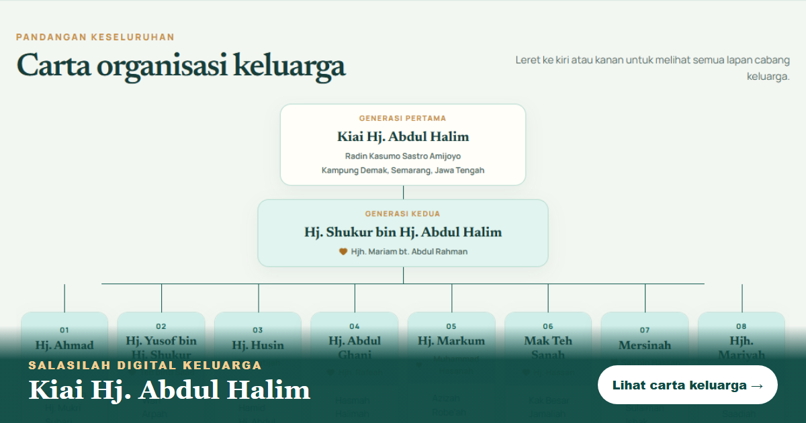

# Salasilah Keluarga Kiai Hj. Abdul Halim

Laman salasilah keluarga digital yang menghimpunkan susur galur Kiai Hj. Abdul Halim dan keluarga Hj. Shukur dalam paparan interaktif, responsif dan mudah digunakan melalui telefon.

## Laman langsung

**[keluarga-kiai-abdul-halim.arif.my](https://keluarga-kiai-abdul-halim.arif.my/)**

- [Lihat carta keluarga](https://keluarga-kiai-abdul-halim.arif.my/#carta)
- [Lihat Program Perhimpunan Keluarga 2026](https://keluarga-kiai-abdul-halim.arif.my/program-2026)



## Ciri utama

- Carta salasilah berlapis dengan cabang keluarga yang boleh dibuka dan ditutup.
- Susun atur responsif untuk telefon, tablet dan komputer.
- Penandaan ahli keluarga yang telah meninggal dunia.
- Pautan WhatsApp pada nombor hubungan yang dibenarkan untuk dipaparkan.
- Menu navigasi pantas ke carta keluarga dan program tahunan.
- Metadata Open Graph dan X/Twitter untuk pratonton pautan yang lebih baik.
- Butang WhatsApp terapung bagi pertanyaan atau pembetulan maklumat.

## Program Perhimpunan Keluarga 2026

Halaman `/program-2026` menyediakan:

- Tarikh, masa, lokasi dan atur cara majlis.
- Kira detik langsung menuju 12 September 2026, 10:30 pagi (Asia/Kuala_Lumpur).
- Pautan navigasi lokasi melalui Waze.
- Pilihan simpan acara ke Google Calendar, Apple Calendar/iPhone/iPad, Outlook dan aplikasi yang menyokong fail `.ics`.
- Poster rasmi dan imej perkongsian sosial khusus untuk halaman program.
- Tarikh Hijri **30 Rabiulawal 1448H**, berdasarkan takwim [Portal e-Solat JAKIM](https://www.e-solat.gov.my/index.php?siteId=24&pageId=26).

## Teknologi

- React 19 dan TypeScript
- [Vinext](https://github.com/cloudflare/vinext) dengan Vite
- Tailwind CSS
- Lucide React
- OpenAI Sites / Cloudflare Workers untuk pengehosan

## Menjalankan secara tempatan

Keperluan: Node.js 22.13 atau lebih baharu.

```bash
npm install
npm run dev
```

Buka `http://localhost:3000` dalam pelayar.

Untuk mengesahkan binaan produksi:

```bash
npm run build
```

Skrip lain yang tersedia:

```bash
npm run lint
npm run format
```

## Struktur ringkas

```text
app/
├── page.tsx                    # Halaman utama dan data salasilah
├── globals.css                 # Tema serta gaya responsif
└── program-2026/
    ├── page.tsx                # Maklumat dan atur cara majlis
    └── countdown.tsx           # Kira detik langsung acara
public/
├── events/                     # Poster, imej sosial dan fail kalendar
├── favicon.svg
└── og-chart-1200x630.png       # Pratonton perkongsian carta
```

## Mengemas kini maklumat keluarga

Data carta diselenggara dalam `app/page.tsx`. Semasa membuat pembetulan:

1. Kekalkan ejaan nama, hubungan kekeluargaan dan susunan generasi berdasarkan maklumat yang disahkan keluarga.
2. Paparkan nombor telefon hanya dengan persetujuan pemiliknya.
3. Gunakan format antarabangsa Malaysia (`60...`) bagi pautan `wa.me`.
4. Jalankan `npm run build` sebelum menerbitkan perubahan.

Pertanyaan dan cadangan pembetulan boleh dihantar melalui butang WhatsApp pada laman langsung.

## Privasi dan penggunaan data

Repositori ini mengandungi nama, hubungan keluarga, bahan acara dan beberapa maklumat hubungan yang disediakan untuk laman keluarga. Jangan menambah atau menggunakan semula data peribadi tanpa kebenaran individu atau keluarga yang berkaitan. Fork awam hendaklah memadam atau menggantikan semua data keluarga dan nombor hubungan terlebih dahulu.

## Lesen

Kod aplikasi dilesenkan di bawah terma MIT seperti diterangkan dalam [LICENSE](LICENSE). Data salasilah, nama, nombor hubungan, poster, foto dan aset keluarga tidak termasuk dalam lesen kod tersebut dan kekal hak keluarga atau pemilik masing-masing.
